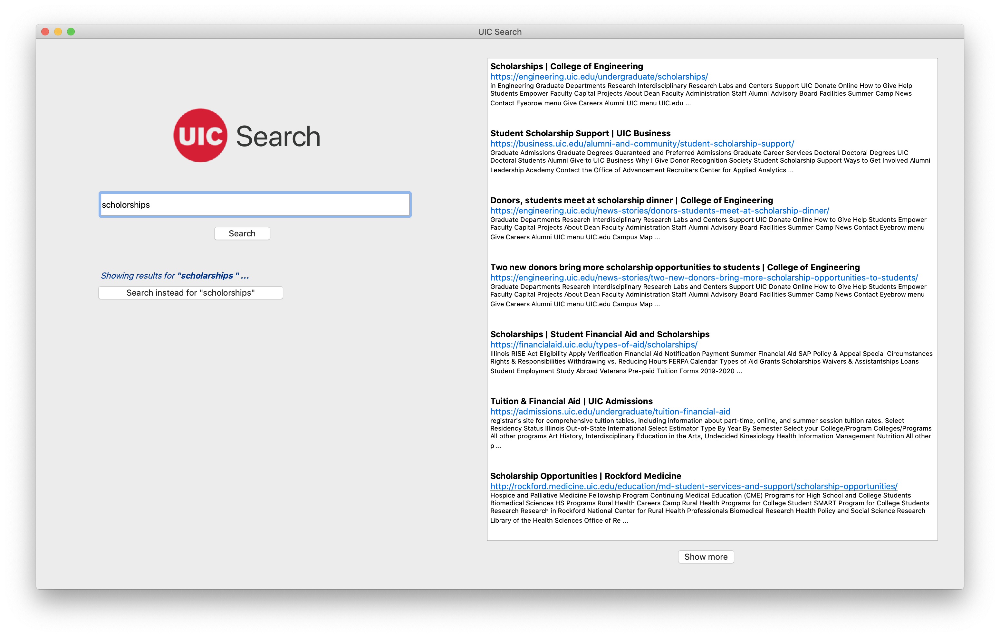

# UIC Search Engine
### UIC Search Engine

Final project for CS 582 Information Retrieval course at University of Illinois at Chicago.

## Dependencies Required
- Scrapy
- BeautifulSoup
- networkx
- nltk
- PyQt5
- pyspellchecker

All the above dependencies can be installed through `pip`

## Running the program

To run the program from terminal just use the command from the home directory of the project:

	> cd user_interface
	> python run_uic_search.py 

If you wish to crawl and run the program from scratch, delete the file "corpus.json" under "crawler/crawler/" directory. It currently crawls for around 7000 pages. To change the number of pages you want to crawl, change the value of "CLOSESPIDER_PAGECOUNT" to your desired number in "crawler/crawler/crawler/settings.py". Then follow the following instructions from the home directory of the project:

	> cd crawler/crawler
	> scrapy crawl uic_spider -o corpus.json
	
Delete the existing pickle files in the "pickles/" directory. From the home directory, run the following commands.

	> cd ir_system
	> python vector_space_model.py
	> python pagerank.py
	> cd ..
	> cd user_interface
	> python run_uic_search.py

# Overview

The search engine takes in the user query, auto-corrects misspelled words in the query and returns a ranked list of most relevant pages to the query within the UIC domain (www.uic.edu). 

# Description

The search engine has the following components:

### Web Crawler 

 Crawls the UIC domain, indexes and generates graph for the crawled pages.
 
### Processor 

Loads individual documents, preprocesses and vectorizes the documents.

### Information Retrieval System

 Runs PageRank on the graph, ranks the documents based on the cosine similarity and the PageRank node scores.
 
### User Interface 

 A graphical user interface of the search engine for the user, which accepts user queries, auto-corrects misspelled words in the query and retrieves the most relevant pages to the query.
